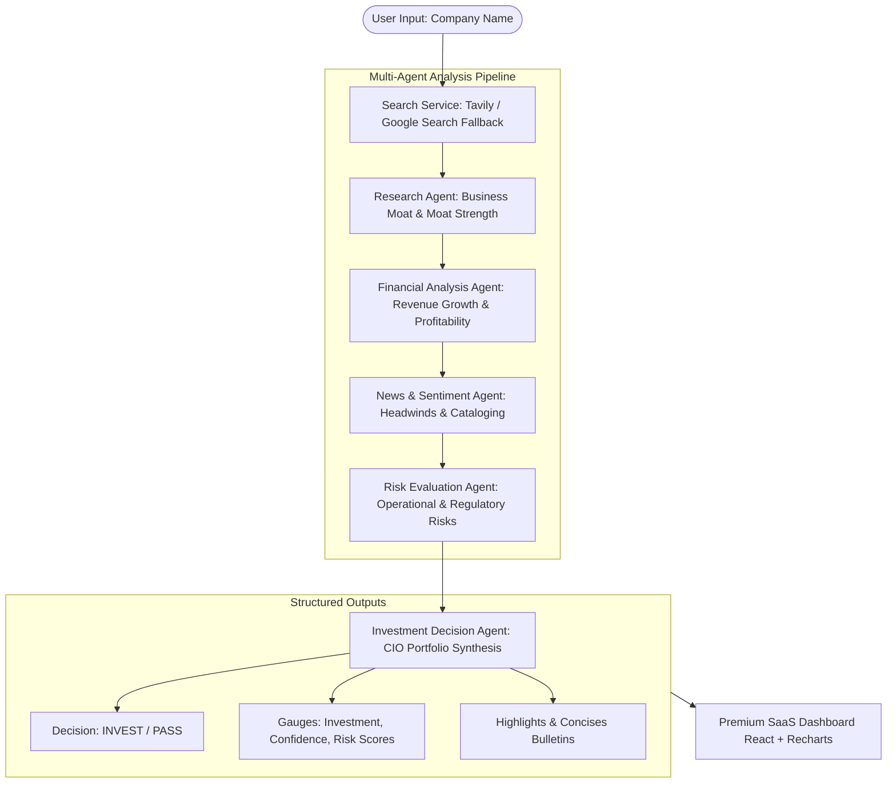

# InvesTrack | AI Investment Research Agent Platform

InvesTrack is a production-grade, full-stack, multi-agent investment research web application. Given a target company name, the platform spins up a committee of autonomous AI agents utilizing **LangChain.js** and **Google Gemini** models to collect intelligence, review financials, analyze sentiment, inspect risks, and compile a final investment thesis with an **INVEST** or **PASS** decision.

---

## 🏗️ System Architecture

The application uses an event-driven, sequential multi-agent workflow. The server streams each agent's execution status to the client in real time using **Server-Sent Events (SSE)**.



---

## 📂 Project Directory Structure

```text
Insideiim/
├── package.json                   # Workspace root config (concurrent running)
├── README.md                      # Setup & documentation
├── server/                        # Node.js + Express Backend
│   ├── package.json
│   ├── .env                       # API Credentials
│   └── src/
│       ├── index.js               # Express app entry
│       ├── routes/
│       │   └── analyze.js         # API endpoints (POST & SSE)
│       └── services/
│           ├── searchService.js   # Tavily web search integration & fallbacks
│           ├── orchestrator.js    # Sequential agent execution coordinator
│           └── agents/            # LangChain Agent classes
│               ├── researchAgent.js
│               ├── financialAgent.js
│               ├── newsAgent.js
│               ├── riskAgent.js
│               └── decisionAgent.js
└── client/                        # React.js + Vite Frontend
    ├── package.json
    ├── vite.config.js
    ├── tailwind.config.js         # Theme & Color setup
    ├── postcss.config.js
    ├── index.html
    └── src/
        ├── index.css              # Custom scrollbars & glassmorphism
        ├── main.jsx               # React DOM mount
        ├── App.jsx                # Main dashboard view & SSE client
        ├── utils/
        │   └── sampleData.js      # Mock company profiles (offline fallback)
        └── components/            # Visual dashboard elements
            ├── SearchBar.jsx      # Input validation & demo triggers
            ├── AgentTerminal.jsx  # Live terminal scrolling outputs
            ├── RecommendationCard.jsx # Verdict & custom SVG Gauges
            ├── CompanyProfileCard.jsx # Corporate segments
            ├── FinancialsChart.jsx    # Recharts area graph
            ├── StrengthsWeaknesses.jsx # Highlight bullets
            └── NewsSentimentCard.jsx   # Sentiment scale
```

---

## 🚀 Setup & Installation

Follow these steps to configure and run the application locally.

### Prerequisites

- **Node.js** (v18.x or higher)
- **npm** (v9.x or higher)

### 1. Clone & Install Dependencies

From the project root (`Insideiim/`), run:

```bash
# Install root, client, and server dependencies
npm run install:all
```

### 2. Configure Environment Variables

Create and edit the `.env` file in the `server/` directory:

```bash
# Navigate to server
cd server
# Create from example
cp .env.example .env
```

Open `server/.env` and supply your credentials:

```text
PORT=5000
GOOGLE_API_KEY=AIzaSy... (Get from Google AI Studio: https://aistudio.google.com/)
TAVILY_API_KEY=tvly-... (Optional: Get from Tavily: https://tavily.com/)
```

> [!NOTE]
> If `GOOGLE_API_KEY` is not present, the server automatically defaults to **Sandbox Mode**, which returns rich mock reports for any company searched. If `TAVILY_API_KEY` is missing but Gemini is active, the agents query Gemini's internal knowledge base with search queries simulated.

### 3. Launch Development Server

Go back to the root workspace directory and run:

```bash
npm run dev
```

This starts:
- **Express Backend**: http://localhost:5000
- **Vite React Frontend**: http://localhost:5173

Open your browser to **http://localhost:5173** to view the application.

---

## ⚡ API Specifications

### 1. Synchronous Analysis Route
- **Endpoint**: `POST /api/analyze`
- **Body**:
  ```json
  {
    "companyName": "NVIDIA",
    "useMockData": false
  }
  ```
- **Response**: Full synthesized JSON report containing scores, overview details, bulleted strengths/concerns, and raw markdown reports.

### 2. Streaming SSE (Server-Sent Events) Route
- **Endpoint**: `GET /api/analyze/stream?companyName=Apple&useMockData=false`
- **Behavior**: Streams progress logs during analysis. Ends with a `complete` event containing the final payload.

---

## 🛠️ Verification & Testing

### Sandbox Mode Testing
1. Toggle the **Sandbox Mode** button to "On" in the search bar.
2. Enter any company (e.g. `Tesla`, `NVIDIA`, `Intel`, or custom name).
3. Click **Analyze**.
4. Observe the rolling agent logs in the scrolling terminal.
5. Review the updated dashboard metrics, Area Charts, and tabs when complete.

---

## 🚢 Production Deployment

### Backend (Node/Express)
1. Build the frontend: `npm run build` in `client/`. This outputs static files to `client/dist/`.
2. Configure Express to serve the static frontend bundle:
   ```javascript
   import path from 'path';
   // Serve static files
   app.use(express.static(path.join(__dirname, '../../client/dist')));
   app.get('*', (req, res) => {
     res.sendFile(path.join(__dirname, '../../client/dist/index.html'));
   });
   ```
3. Deploy to Heroku, Render, AWS Elastic Beanstalk, or Google App Engine, making sure to configure server-side environment variables.

### Frontend
Vite build files can also be hosted independently on static hosting platforms like Vercel, Netlify, or GitHub Pages. In this setup, update the Vite proxy configuration or specify absolute URLs for backend API calls.
